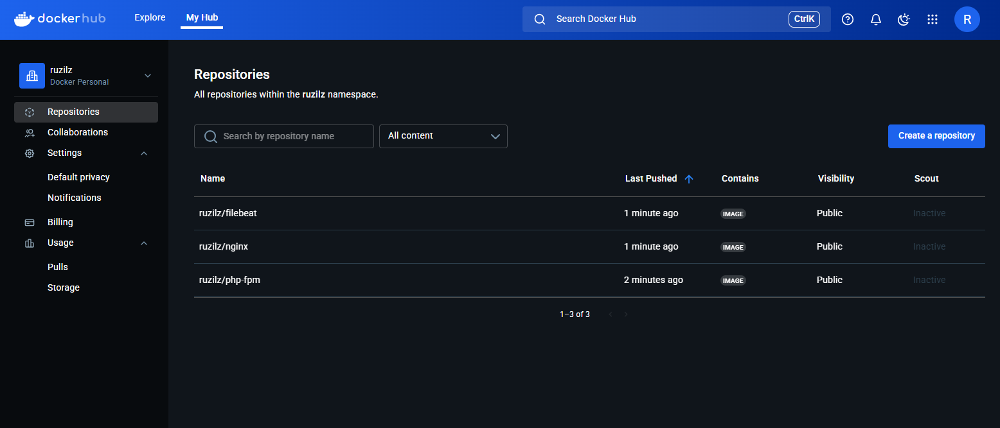
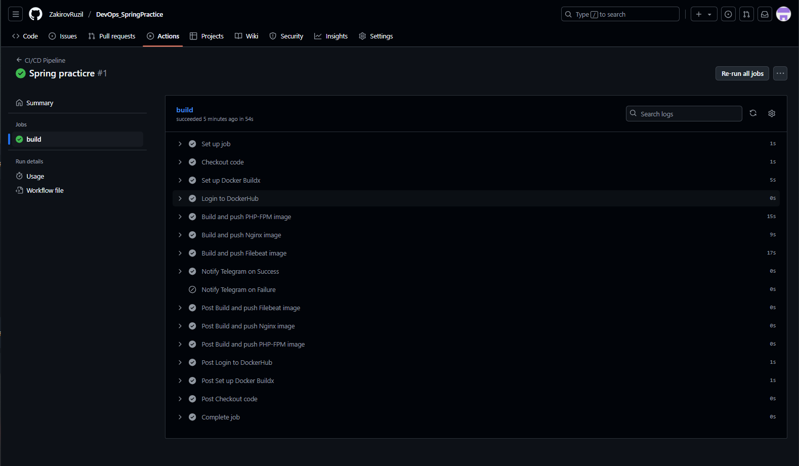
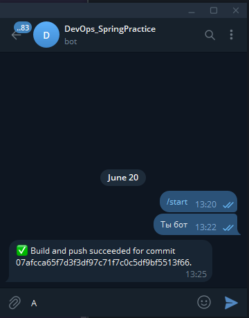
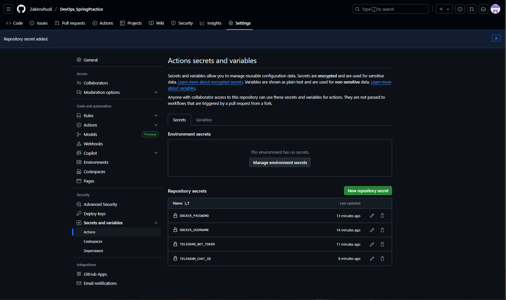

### Триггеры
CI/CD процесс запускается автоматически при каждом коммите в ветку `main`.

### Сборка: автоматическая и ручная
1. Автоматическая сборка:
Выполняется без вмешательства пользователя при каждом изменении в ветке `main`. Это обеспечивается конфигурацией `on: push: branches: [main]` в `.github/workflows/`main.yml.

2. Ручная сборка:
Для ручного запуска процесса сборки и публикации доступны скрипты `build.sh` и `deploy.sh`.

### Сохранение артефактов
Собранные Docker-образы публикуются в личный репозиторий Docker Hub. Доступ к нему обеспечивается через секреты `DOCKER_USERNAME` и `DOCKER_PASSWORD`, заданные в настройках GitHub.

### Фотокарточки

